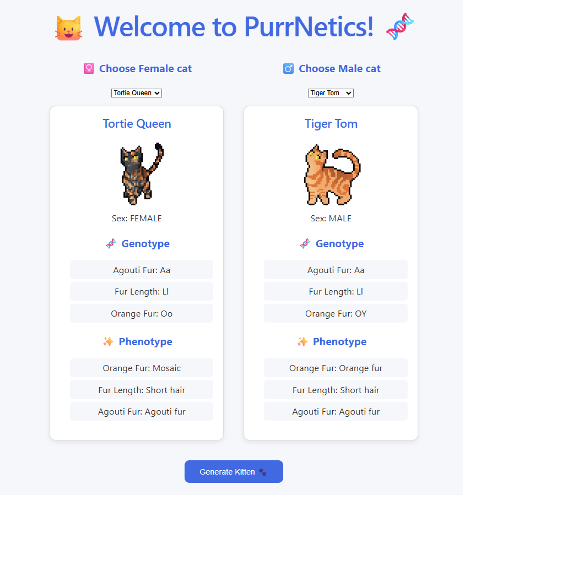
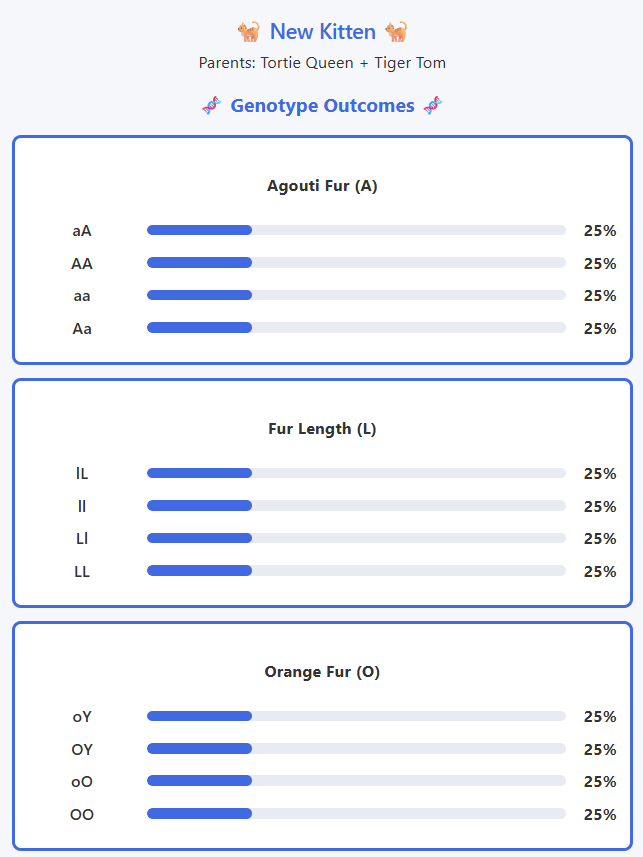
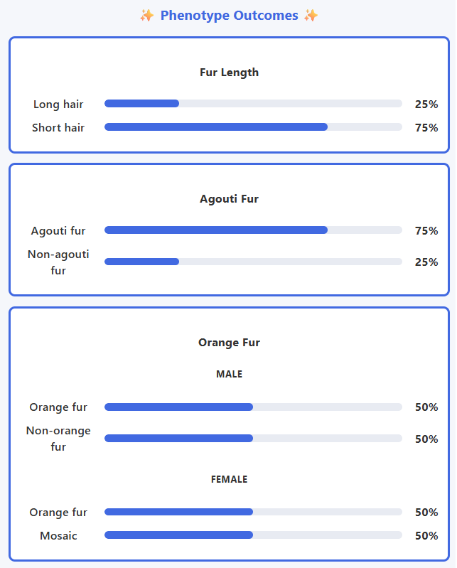
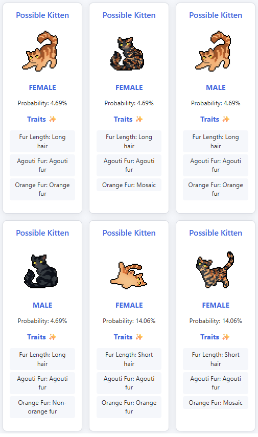

# PurrNetics

## About
PurrNetics is a full-stack simulation application that models possible cat coat outcomes from breeding pairs. The project applies domain knowledge of cat genetics to design and implement inheritance and trait-expression rules, with the simulation logic implemented in a Java backend using Spring Boot and visualized through a React frontend.

Users can select parent cats and explore possible offspring through calculated genotype and phenotype probability distributions.

## Features
- Select parent cats
- Simulate breeding outcomes
- Calculate genotype probability distributions
- Calculate phenotype probability distributions
- Support autosomal and X-linked inheritance
- Model inheritance and trait-expression rules independently

## Demo
### Parent Cat Selector

<div align = "center">

</div>

### Breeding Result

<div align = "center">


</div>

### Possible Offspring Outcomes

<div align = "center">

</div>

## Technical Architecture
PurrNetics uses a full-stack architecture with a React frontend and Java/Spring Boot REST API backend,

### The Java/Spring Boot Backend
- Manages cat data
- Applies genetic inheritance rules
- Calculates genotype outcomes
- Determines phenotype expression
- Exposes breeding simulations through REST endpoints

The simulation separates inheritance logic from trait-expression logic. This allows the system to determine which alleles an offspring inherits independently from how those alleles are expressed as observable traits.

The core domain flow that is modelled is:

```text 
Gene 
↓ 
Alleles 
↓ 
AllelePair (maternal + paternal genetic contributions) 
↓ 
InheritanceRule 
↓ 
ExpressionRule
↓ 
Phenotype
```

The API flow is:
```text 
React Frontend
↓
Breed Request 
↓ 
REST Controller
↓ 
Breeding Service
↓ 
Domain/Simulation Logic
↓ 
Breeding Result (JSON)
↓
React Frontend
```

### React Frontend
- Allows users to select parent cats
- Displays parent genetics and traits
- Sends breed requests to the backend
- Visualizes genotype and phenotype probability distributions
- Displays possible offspring outcomes

## Testing
PurrNetics uses JUnit to test inheritance, expression, and simulation behaviour. 
The test suite includes:
-  Unit tests for inheritance and trait-expression rules
-  Tests for autosomal and X-linked inheritance calculations
-  10,000 independent breeding trials compared against expected probability ratios
-  Chi-square tests to statistically validate simulated outcomes against expected ratios

## Tech Stack
### Backend
- Java
- Spring Boot
- Maven
- REST API
### Frontend
- React
- Vite
- JavaScript
- CSS
### Testing
JUnit
### Development Tool
- Git
- GitHub
- VS Code
### Data Format
JSON-based API communication

## Running the Application
### Make sure you have installed the following:
- Java 21+
- Maven
- Node.js and npm
### 1. Start the Spring Boot API
From the project root 
```bash
mvn spring-boot:run
```
The backend API will start at http://localhost:8080

### 2. Start the React Frontend
Open a second terminal and navigate to the frontend
```bash
cd frontend
```
Install frontend dependencies (first time only)
```bash
npm install
```
Start the development server
```bash
npm run dev
```
The frontend is available at http://localhost:5173 

## Currently Supported Traits
### Agouti Fur
The agouti gene determines whether a cat will have tabby stripes. This gene follows an autosomal inheritance and complete dominance expression. 
| Genotype | Phenotype |
| --- | --- |
| AA | Agouti fur | 
| Aa | Agouti fur | 
| aa | Non-agouti fur | 

### Fur Length
The fur length gene follows autosomal inheritance and complete dominance expression.
| Genotype | Trait | 
|---|---| 
| LL | Short hair |
| Ll | Short hair | 
| ll | Long hair | 

### Orange Fur
The orange fur gene is X-linked, resulting in different expression patterns in females and males.
#### Female Cats
| Genotype | Phenotype | 
| --- | --- | 
| OO | Orange fur | 
| Oo | Mosaic expression (calico or tortoiseshell fur pattern) |
| oo | Non-orange fur | 
#### Male Cats
Because male cats inherit their single X chromosome from their mother, their genotype is represented differently from female cats. For clarity, PurrNetics represents the lack of paternal X-linked gene contribution as "Y" to reflect the Y chromosome.
| Genotype | Phenotype |
| --- | --- |
| OY | Orange fur |
| oY | Non-orange fur | 

## Future Improvements
- Add additional coat colour and pattern genes
- Include epistatic and polygenic modes of expression
- Create Punnett square visualizations

## Domain Background
PurrNetics models both **genotype** (the inherited genetic information an organism carries) and **phenotype** (the observable traits produced by expressing that genetic information). 

### 1. Genes and Alleles
**Deoxyribonucleic acid** (DNA) is a biological molecule that contains genetic information that encodes traits. **Genes** are distinct segments of DNA that are involved in producing specific traits.
#### Examples:
- Fur length gene
- Agouti pattern gene
- Orange fur gene
  
A gene can have different versions called **alleles**. These alleles are often represented by letters for brevity. 

#### For example, the fur length gene has…
- `L` = short hair allele, which is the gene variant that encodes short coats
- `l` = long hair allele, which is the gene variant that encodes long coats

### 2. Genotypes
For most genes, a cat receives two copies:
- One allele from its mother
- One allele from its father

The combination of alleles is called a **genotype**. 

#### Example: `Ll`
- Maternal allele: `L`
- Paternal allele: `l`

### 3. Maternal and Paternal Inheritance
During reproduction, each parent passes one allele for each gene to their offspring. This combination creates the kitten’s genotype.
#### A simple example using the fur length gene:
- If mother’s genotype is `Ll`, that means it can either pass down `L` or `l` to a kitten
- If a father’s genotype is  `Ll`, that means it can either pass down `L` or `l` to a kitten 

Possible kitten outcomes:
- 25% `LL`
- 50% `Ll`
- 25% `ll`
 
### 4. From Genotype to Trait
Interestingly, a genotype does not always directly equal an observable trait. Genes have particular expression rules that determine **phenotype**, which is the set of observable characteristics/traits that arise from a particular genotype. PurrNetics uses these expression rules to determine phenotype.
#### Example
| Genotype | Trait | 
|---|---| 
| LL | Short hair |
| Ll | Short hair | 
| ll | Long hair | 

Notice how a kitten needs two copies of `l` to have long hair. In other words, `L` “masks” the effect of `l`, resulting in a kitten with short hair. This is known as **complete dominance**. The `L` allele is dominant to the `l` allele. Another way to represent this relationship is that the `l` allele is recessive to the `L` allele.

### 5. X-Linked Traits
For the majority of mammals, including cats, sex is determined by special chromosomes (X and Y). 
- Females: XX
- Males: XY
  
Some genes (like the gene that determines orange fur) are located on the X chromosome (known as **X-linked**) but not on the Y chromosome. As a result, this creates different inheritance patterns between males and females. Females inherit two copies of all genes on the X chromosome because they receive one X chromosome from mom and one X chromosome from dad. On the other hand, males inherit an X chromosome from mom and a Y chromosome from dad. As a result, males only receive one copy of all X-linked genes from their mother. This genetic phenomenon is known as **hemizygosity**. PurrNetics models X-linked inheritance separately from **autosomal** (genes that are not on sex chromosomes) inheritance to account for these differences. 

## Credits
Cat sprites were created by ClanGen
